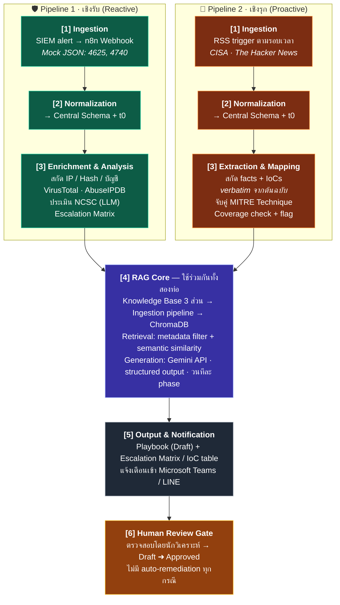

## 1. สถาปัตยกรรม

ระบบแบ่งเป็น 6 ชั้น (layers) โดยชั้นที่ 1–3 แยกตามท่อ ส่วนชั้นที่ 4–6 ใช้ร่วมกัน

---

## 2. Pipeline 1 — เชิงรับ (Reactive)

| ขั้น | การทำงาน | องค์ประกอบใน n8n |
|------|----------|-------------------|
| 1 | รับ mock SIEM alert (Windows Event 4625/4740) | Webhook node |
| 2 | Normalize → Central Schema, ประทับ t0–t1, ตรวจ dedup | Function/Code node |
| 3 | สกัด observables (IP, hash, account, host) | Code node |
| 4 | CTI enrichment — ตรวจชื่อเสียง IP/Hash | HTTP Request → VirusTotal, AbuseIPDB |
| 5 | ประเมินความรุนแรงตามกรอบ NCSC (structured output) | LLM node → Gemini API |
| 6 | สร้าง Escalation Matrix 3 ระดับชั้น | LLM node + template |
| 7 | สร้าง playbook แบบวนทีละ phase: Containment → Eradication → Recovery — แต่ละรอบค้นคืนจาก ChromaDB ด้วย metadata filter (ประเภทภัยคุกคาม + phase) ร่วมกับ semantic similarity แล้วให้ LLM เรียบเรียงเฉพาะ phase นั้น | Loop + Vector query + LLM node |
| 8 | รวม playbook, ตั้งสถานะ Draft, แจ้งเตือน, เข้าสู่ Review Gate | Merge → Notify → Wait/Approval |

**เหตุผลที่วนทีละ phase แทนสร้างครั้งเดียว:** บริบทที่ส่งให้ LLM ต่อรอบเล็กลงและตรงประเด็น การ ground แม่นขึ้น ตรวจสอบย้อนกลับได้ระดับ section และถ้า phase ใด retrieval ได้คะแนนต่ำ ระบบติด coverage flag เฉพาะ phase นั้นได้ (แลกกับจำนวน API call ที่มากขึ้น — ดูตาราง trade-offs)

---

## 3. Pipeline 2 — เชิงรุก (Proactive)

| ขั้น | การทำงาน | องค์ประกอบใน n8n |
|------|----------|-------------------|
| 1 | ดึงข่าวตามรอบเวลา | RSS/Schedule trigger |
| 2 | ดึงเนื้อหาเต็ม, normalize → Central Schema, dedup ข้ามแหล่งข่าว | HTTP Request + Code node |
| 3 | สกัดข้อเท็จจริงและ IoCs แบบ verbatim — prompt บังคับให้คัดข้อความตรงจากต้นฉบับเท่านั้น พร้อมตำแหน่งอ้างอิง | LLM node (extraction prompt) |
| 4 | จับคู่ MITRE Technique จากพฤติกรรมที่สกัดได้ | LLM node + mitreattack-python (offline) |
| 5 | Knowledge coverage check — query ChromaDB ด้วย technique ที่จับคู่ได้ ตัดสิน tier: full / partial / none | Vector query + Code node |
| 6 | สร้าง proactive playbook ด้วย RAG กลไกเดียวกับท่อ 1 — บริบท 3 ชั้น: (ก) facts จากข่าว (ข) เอกสารแนวทางป้องกันรายเทคนิคจาก KB (ค) MITRE Mitigations อย่างเป็นทางการ — ได้ผลลัพธ์: แนวทางตรวจสอบผลกระทบ, ขั้นตอนปิดช่องโหว่, ข้อเสนอกฎตรวจจับ, ตาราง IoCs | Loop + Vector query + LLM node |
| 7 | ติดธง coverage tier บนผลลัพธ์, แจ้งเตือน, Review Gate | Notify → Approval |

---

## 4. RAG Core (ใช้ร่วมกันทั้งสองท่อ)

### 4.1 Knowledge Base — 3 ส่วนตาม scope

| ส่วน | ที่มา | metadata หลัก |
|------|-------|----------------|
| IR Playbook อ้างอิงสำหรับภัยคุกคาม AD | คณะผู้จัดทำเขียนและคัดกรองเอง | `threat_type`, `phase`, `doc_type=playbook` |
| เอกสารแนวทางป้องกันรายเทคนิค | คณะผู้จัดทำรวบรวม/เรียบเรียง | `technique_id`, `doc_type=defense` |
| MITRE ATT&CK Mitigations | mitreattack-python (offline) | `technique_id`, `mitigation_id`, `doc_type=mitre` |

### 4.2 Ingestion pipeline

แบ่งเอกสารเป็น chunk ตามหน่วยความหมาย (playbook แบ่งตาม phase/ขั้นตอน, เอกสารป้องกันแบ่งตามเทคนิค) → แท็ก metadata → แปลงเป็นเวกเตอร์ด้วย embedding model ขนาดเล็กที่รันในเครื่อง → เก็บใน ChromaDB — การปรับปรุงฐานความรู้ทำโดยแก้เอกสารแล้วนำเข้าใหม่ ไม่ต้องแก้โค้ด

### 4.3 Retrieval

สองชั้นเสมอ: **metadata filter ก่อน** (`technique_id` / `threat_type` / `phase` / `doc_type`) **แล้วจึง semantic similarity** ภายในชุดที่กรองแล้ว — กัน chunk ที่ "ฟังดูคล้าย" แต่คนละเทคนิคหลุดเข้ามาเป็นบริบท ซึ่งเป็นความเสี่ยงหลักของ RAG ในเอกสารเชิงปฏิบัติการ

### 4.4 Knowledge Coverage Warning (logic ร่าง)

- **full** — มีเอกสาร `doc_type=defense` ที่ `technique_id` ตรง และ similarity score เกิน threshold → สร้าง playbook เต็มรูปแบบ
- **partial** — มีเฉพาะ MITRE Mitigations หรือ score ก้ำกึ่ง → สร้างได้แต่ติดธงกำกับทุก section ที่อิงข้อมูลบาง
- **none** — ไม่มีเอกสารตรงเลย → ไม่สร้างขั้นตอนปฏิบัติ รายงานเฉพาะ facts + IoCs จากข่าว พร้อมแจ้งชัดว่าฐานความรู้ไม่ครอบคลุม

ค่า threshold ควรได้จากการทดลองกับชุดทดสอบ (ขั้นตอนที่ 8 ของวิธีดำเนินงาน) ไม่ใช่ตั้งลอย ๆ

---

## 5. Output, Notification และ Human Review Gate

ผลลัพธ์ทุก case ส่งเข้า Microsoft Teams / LINE ในรูปสรุปย่อ (ระดับ NCSC หรือ coverage tier + entities หลัก) พร้อมเอกสารเต็ม สถานะเริ่มต้นเป็น **Draft เสมอ** นักวิเคราะห์เป็นผู้กดรับรองจึงเปลี่ยนเป็น **Approved** (ประทับ t6) ระบบไม่ส่งคำสั่งใด ๆ ไปยังอุปกรณ์เครือข่าย — ขอบเขต **No Auto-Remediation** นี้ควรเขียนเป็นคุณสมบัติของสถาปัตยกรรม ไม่ใช่แค่ข้อจำกัด เพราะมันคือเหตุผลที่ระบบปลอดภัยพอจะใช้ LLM ได้

---
