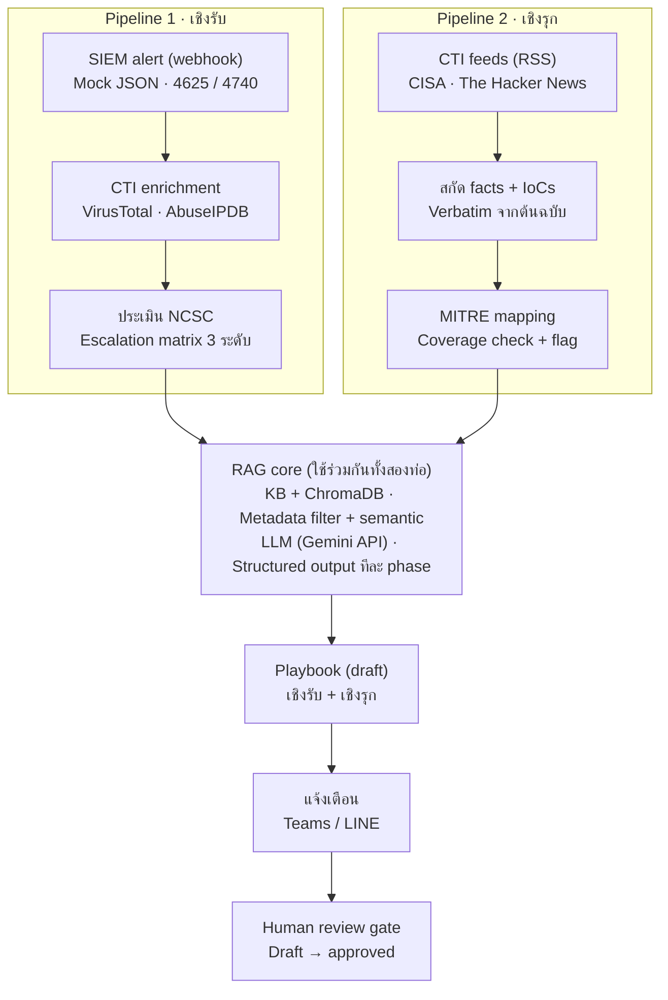
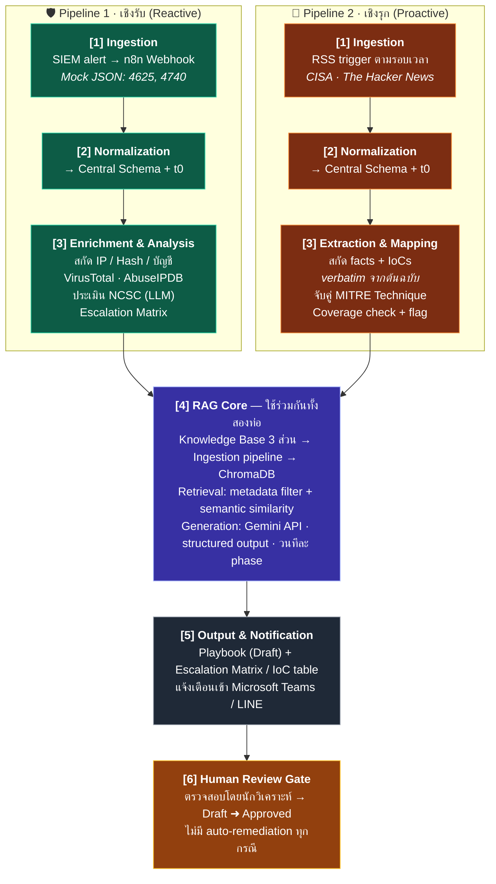

# ร่างสถาปัตยกรรมระบบ — AI-Driven SOC Copilot (Dual-Pipeline)

> เอกสารร่างสถาปัตยกรรม อ้างอิงจากแบบเสนอหัวข้อโครงงาน
> "Development of an Automated Workflow for IR Playbook Generation and Cyber Threat Intelligence Analysis"



---

## 1. ภาพรวมและหลักการออกแบบ

ระบบเป็นผู้ช่วยวิเคราะห์สำหรับ SOC ที่ทำงานสองมิติบนแกนกลางเดียวกัน โดยยึดหลักการออกแบบ 5 ข้อที่สืบเนื่องจากวัตถุประสงค์ใน proposal โดยตรง

1. **Grounding ก่อน generation** — เนื้อหา playbook ทุกส่วนต้องผ่านการค้นคืนจาก knowledge base ที่มนุษย์คัดกรอง ไม่ปล่อยให้ LLM สร้างจากความจำภายในของโมเดล
2. **Central Schema เดียว** — ข้อมูลนำเข้าทั้ง SIEM alert และ CTI feed ถูก normalize เป็นโครงสร้างเดียวกันตั้งแต่ต้นทาง ทำให้ RAG core, ระบบแจ้งเตือน และการวัดผลใช้ logic ชุดเดียว
3. **รู้ขีดจำกัดตัวเอง** — ระบบต้องรายงาน Knowledge Coverage Warning เมื่อฐานความรู้ไม่ครอบคลุม แทนที่จะเดา
4. **Human-in-the-Loop เสมอ** — ผลลัพธ์ทุกชิ้นมีสถานะ Draft จนกว่ามนุษย์รับรอง และไม่มี auto-remediation
5. **วัดผลได้ตั้งแต่ออกแบบ** — จุดประทับเวลา (stage timestamps) ฝังอยู่ใน schema ตั้งแต่แรก เพื่อให้วัด TTR ได้โดยไม่ต้องแก้ระบบทีหลัง

---

## 2. สถาปัตยกรรมระดับสูง

ระบบแบ่งเป็น 6 ชั้น (layers) โดยชั้นที่ 1–3 แยกตามท่อ ส่วนชั้นที่ 4–6 ใช้ร่วมกัน



---

## 3. Central Schema (ร่าง)

โครงสร้างข้อมูลกลางที่ทั้งสองท่อต้อง map เข้า ก่อนเข้าสู่ชั้นวิเคราะห์ใด ๆ — ออกแบบเองตาม scope ข้อ 4 ของ proposal

```json
{
  "case_id": "uuid",
  "pipeline": "reactive | proactive",
  "dedup_key": "hash(source_id + entity หลัก)",
  "source": {
    "type": "siem_alert | cti_feed",
    "ref": "event id หรือ URL ข่าวต้นฉบับ",
    "raw": "payload ดิบ เก็บไว้เพื่อตรวจสอบย้อนกลับ"
  },
  "timestamps": {
    "t0_ingested": "...",
    "t1_normalized": "...",
    "t2_enriched": "...",
    "t3_assessed": "...",
    "t4_playbook_done": "...",
    "t5_notified": "...",
    "t6_human_approved": "..."
  },
  "entities": {
    "ips": [], "hashes": [], "domains": [],
    "accounts": [], "hosts": []
  },
  "mitre": { "techniques": ["T1110", "..."] },
  "enrichment": {
    "virustotal": {}, "abuseipdb": {}
  },
  "assessment": {
    "ncsc_category": "C1–C6",
    "rationale": "เหตุผลจาก LLM (structured)",
    "escalation_tier": "1 | 2 | 3"
  },
  "coverage": {
    "tier": "full | partial | none",
    "flags": ["technique ที่ KB ไม่ครอบคลุม"]
  },
  "artifacts": {
    "escalation_matrix": {},
    "ioc_table": [],
    "playbook": { "status": "draft | approved", "sections": [] }
  }
}
```

**ประเด็นออกแบบที่ควรระบุในเล่ม:**

- **dedup_key** — SIEM ยิง alert ซ้ำได้ (brute force ก่อ event 4625 เป็นชุด) และข่าวเดียวกันมาจากหลาย feed ได้ ถ้าไม่มี dedup ตั้งแต่ชั้น normalize ระบบจะสร้าง playbook ซ้ำและตัวเลข TTR จะเพี้ยน
- **timestamps ครบทุก stage** — ทำให้แยกได้ว่าเวลาเสียไปที่ enrichment API, ที่ LLM หรือที่มนุษย์ ซึ่งจำเป็นต่อการเทียบกับกระบวนการแมนนวลตามวัตถุประสงค์ข้อ 5
- **raw payload เก็บเสมอ** — เป็นหลักฐานตรวจสอบย้อนกลับว่า IoC ที่สกัดแบบ verbatim ตรงกับต้นฉบับจริง

---

## 4. Pipeline 1 — เชิงรับ (Reactive)

| ขั้น | การทำงาน | องค์ประกอบใน n8n |
|------|----------|-------------------|
| 1 | รับ mock SIEM alert (Windows Event 4625/4740) | Webhook node |
| 2 | Normalize → Central Schema, ประทับ t0–t1, ตรวจ dedup | Function/Code node |
| 3 | สกัด observables (IP, hash, account, host) | Code node |
| 4 | CTI enrichment — ตรวจชื่อเสียง IP/Hash | HTTP Request → VirusTotal, AbuseIPDB |
| 5 | ประเมินความรุนแรงตามกรอบ NCSC (structured output) | LLM node → Gemini API |
| 6 | สร้าง Escalation Matrix 3 ระดับชั้น | LLM node + template |
| 7 | สร้าง playbook แบบวนทีละ phase: Containment → Eradication → Recovery — แต่ละรอบค้นคืนจาก ChromaDB ด้วย metadata filter (ประเภทภัยคุกคาม + phase) ร่วมกับ semantic similarity แล้วให้ LLM เรียบเรียงเฉพาะ phase นั้น | Loop + Vector query + LLM node |
| 8 | รวม playbook, ตั้งสถานะ Draft, แจ้งเตือน, เข้าสู่ Review Gate | Merge → Notify → Wait/Approval |

**เหตุผลที่วนทีละ phase แทนสร้างครั้งเดียว:** บริบทที่ส่งให้ LLM ต่อรอบเล็กลงและตรงประเด็น การ ground แม่นขึ้น ตรวจสอบย้อนกลับได้ระดับ section และถ้า phase ใด retrieval ได้คะแนนต่ำ ระบบติด coverage flag เฉพาะ phase นั้นได้ (แลกกับจำนวน API call ที่มากขึ้น — ดูตาราง trade-offs)

---

## 5. Pipeline 2 — เชิงรุก (Proactive)

| ขั้น | การทำงาน | องค์ประกอบใน n8n |
|------|----------|-------------------|
| 1 | ดึงข่าวตามรอบเวลา | RSS/Schedule trigger |
| 2 | ดึงเนื้อหาเต็ม, normalize → Central Schema, dedup ข้ามแหล่งข่าว | HTTP Request + Code node |
| 3 | สกัดข้อเท็จจริงและ IoCs แบบ verbatim — prompt บังคับให้คัดข้อความตรงจากต้นฉบับเท่านั้น พร้อมตำแหน่งอ้างอิง | LLM node (extraction prompt) |
| 4 | จับคู่ MITRE Technique จากพฤติกรรมที่สกัดได้ | LLM node + mitreattack-python (offline) |
| 5 | Knowledge coverage check — query ChromaDB ด้วย technique ที่จับคู่ได้ ตัดสิน tier: full / partial / none | Vector query + Code node |
| 6 | สร้าง proactive playbook ด้วย RAG กลไกเดียวกับท่อ 1 — บริบท 3 ชั้น: (ก) facts จากข่าว (ข) เอกสารแนวทางป้องกันรายเทคนิคจาก KB (ค) MITRE Mitigations อย่างเป็นทางการ — ได้ผลลัพธ์: แนวทางตรวจสอบผลกระทบ, ขั้นตอนปิดช่องโหว่, ข้อเสนอกฎตรวจจับ, ตาราง IoCs | Loop + Vector query + LLM node |
| 7 | ติดธง coverage tier บนผลลัพธ์, แจ้งเตือน, Review Gate | Notify → Approval |

---

## 6. RAG Core (ใช้ร่วมกันทั้งสองท่อ)

### 6.1 Knowledge Base — 3 ส่วนตาม scope

| ส่วน | ที่มา | metadata หลัก |
|------|-------|----------------|
| IR Playbook อ้างอิงสำหรับภัยคุกคาม AD | คณะผู้จัดทำเขียนและคัดกรองเอง | `threat_type`, `phase`, `doc_type=playbook` |
| เอกสารแนวทางป้องกันรายเทคนิค | คณะผู้จัดทำรวบรวม/เรียบเรียง | `technique_id`, `doc_type=defense` |
| MITRE ATT&CK Mitigations | mitreattack-python (offline) | `technique_id`, `mitigation_id`, `doc_type=mitre` |

### 6.2 Ingestion pipeline

แบ่งเอกสารเป็น chunk ตามหน่วยความหมาย (playbook แบ่งตาม phase/ขั้นตอน, เอกสารป้องกันแบ่งตามเทคนิค) → แท็ก metadata → แปลงเป็นเวกเตอร์ด้วย embedding model ขนาดเล็กที่รันในเครื่อง → เก็บใน ChromaDB — การปรับปรุงฐานความรู้ทำโดยแก้เอกสารแล้วนำเข้าใหม่ ไม่ต้องแก้โค้ด

### 6.3 Retrieval

สองชั้นเสมอ: **metadata filter ก่อน** (`technique_id` / `threat_type` / `phase` / `doc_type`) **แล้วจึง semantic similarity** ภายในชุดที่กรองแล้ว — กัน chunk ที่ "ฟังดูคล้าย" แต่คนละเทคนิคหลุดเข้ามาเป็นบริบท ซึ่งเป็นความเสี่ยงหลักของ RAG ในเอกสารเชิงปฏิบัติการ

### 6.4 Knowledge Coverage Warning (logic ร่าง)

- **full** — มีเอกสาร `doc_type=defense` ที่ `technique_id` ตรง และ similarity score เกิน threshold → สร้าง playbook เต็มรูปแบบ
- **partial** — มีเฉพาะ MITRE Mitigations หรือ score ก้ำกึ่ง → สร้างได้แต่ติดธงกำกับทุก section ที่อิงข้อมูลบาง
- **none** — ไม่มีเอกสารตรงเลย → ไม่สร้างขั้นตอนปฏิบัติ รายงานเฉพาะ facts + IoCs จากข่าว พร้อมแจ้งชัดว่าฐานความรู้ไม่ครอบคลุม

ค่า threshold ควรได้จากการทดลองกับชุดทดสอบ (ขั้นตอนที่ 8 ของวิธีดำเนินงาน) ไม่ใช่ตั้งลอย ๆ

---

## 7. Output, Notification และ Human Review Gate

ผลลัพธ์ทุก case ส่งเข้า Microsoft Teams / LINE ในรูปสรุปย่อ (ระดับ NCSC หรือ coverage tier + entities หลัก) พร้อมเอกสารเต็ม สถานะเริ่มต้นเป็น **Draft เสมอ** นักวิเคราะห์เป็นผู้กดรับรองจึงเปลี่ยนเป็น **Approved** (ประทับ t6) ระบบไม่ส่งคำสั่งใด ๆ ไปยังอุปกรณ์เครือข่าย — ขอบเขต **No Auto-Remediation** นี้ควรเขียนเป็นคุณสมบัติของสถาปัตยกรรม ไม่ใช่แค่ข้อจำกัด เพราะมันคือเหตุผลที่ระบบปลอดภัยพอจะใช้ LLM ได้

---

## 8. การวัดผล (ฝังในสถาปัตยกรรม)

| ตัวชี้วัด | วิธีวัดจากระบบ |
|-----------|----------------|
| TTR | t5 − t0 (ระบบ) และ t6 − t0 (รวมมนุษย์) เทียบกับ baseline แมนนวลที่จับเวลาจากขั้นตอนเดียวกัน |
| ความถูกต้อง NCSC | เทียบผลประเมินกับเฉลยที่กำหนดไว้ต่อ scenario |
| ความครบถ้วน IoCs | precision / recall เทียบชุดเฉลยจากข่าวจริงที่คัดไว้ |
| คุณภาพ retrieval | ตรวจว่า chunk ที่ค้นคืนมาตรง technique/phase หรือไม่ (มี metadata ให้ตรวจอัตโนมัติได้) |
| Coverage Warning | ทดสอบด้วยภัยคุกคามนอกฐานความรู้ ยืนยันว่าระบบตอบ tier=none ไม่ใช่เดา |

---

## 9. ความปลอดภัยของตัวระบบเอง

- **Prompt injection ผ่านข่าว** — เนื้อหาข่าวใน Pipeline 2 เป็น input ที่ควบคุมไม่ได้ อาจมีข้อความสั่ง LLM ฝังอยู่ สถาปัตยกรรมจึงแยกบทบาทชัด: ขั้น extraction ให้ LLM คัดข้อความ verbatim เท่านั้น (ไม่ทำตามคำสั่งในเนื้อหา) และขั้น generation ใช้บริบทจาก KB ที่คัดกรองแล้วเป็นหลัก ไม่ส่งเนื้อข่าวดิบทั้งก้อนเข้า prompt สร้าง playbook
- **API keys** — เก็บใน credential store ของ n8n ไม่ hardcode ใน workflow
- **ข้อมูลส่วนบุคคล** — ใช้ mock data ฝั่ง SIEM ตาม scope จึงไม่มีข้อมูลจริงไหลออกไปยัง cloud LLM

---

## 10. Trade-offs ของการตัดสินใจหลัก

| การตัดสินใจ | ได้ | แลกกับ |
|-------------|-----|--------|
| n8n (low-code) เป็นแกน workflow | เห็นภาพ data flow ชัด สร้าง/แก้เร็ว เหมาะกับทีม 2 คนและกรอบเวลา | logic ซับซ้อนต้องยัดใน Code node, ทดสอบอัตโนมัติยากกว่าเขียนโค้ดเอง |
| ChromaDB + embedding รันในเครื่อง | ง่าย ฟรี ไม่พึ่ง cloud, ข้อมูล KB ไม่ออกนอกเครื่อง | ไม่ scale สำหรับ production จริง (ยอมรับได้ในระดับต้นแบบ) |
| Cloud LLM (Gemini API) ไม่โฮสต์เอง | คุณภาพภาษา/เหตุผลสูง ไม่ต้องมี GPU | พึ่ง network + quota, ข้อมูลผ่าน cloud (บรรเทาด้วย mock data) |
| สร้าง playbook วนทีละ phase | grounding แม่น ตรวจย้อนกลับระดับ section, ติด flag เฉพาะจุดได้ | API call มากขึ้น → latency และค่าใช้จ่ายต่อ case สูงขึ้น |
| Metadata filter ก่อน semantic search | precision สูง กันบริบทผิดเทคนิค | ถ้าแท็ก metadata ผิด เอกสารจะหายจากการค้นคืนทั้งชิ้น — คุณภาพ KB จึงเป็นคอขวด |
| Central Schema ออกแบบเอง | ตรงโจทย์ เบา ควบคุมได้เต็มที่ | ไม่เข้ากับมาตรฐาน (OCSF/STIX) ทันที — ระบุเป็น future work ได้ว่า IoC table map เข้า STIX ภายหลัง |

---

## 11. จุดที่ควรทบทวนเมื่อระบบโต

- **คุณภาพและปริมาณ KB คือคอขวดจริงของระบบ** — สถาปัตยกรรมดีแค่ไหน playbook ก็ดีได้เท่าที่เอกสารใน KB ดี ควรกำหนดขั้นต่ำของจำนวนเอกสารต่อ technique ตั้งแต่ต้นโครงการ
- **Feedback loop จาก Review Gate** — ตอนนี้ผลการ approve/แก้ไขของมนุษย์ยังไม่ไหลกลับเข้า KB โดยอัตโนมัติ ระยะถัดไปควรเก็บ diff ระหว่าง draft กับฉบับที่มนุษย์แก้ เป็นวัตถุดิบปรับปรุงเอกสาร
- **ขยายเกิน AD** — โครง metadata ที่ยึดแกน MITRE Technique ทำให้เพิ่มโดเมนใหม่ (web server, endpoint) ได้ด้วยการเพิ่มเอกสาร ไม่ต้องแก้สถาปัตยกรรม — เป็นข้อพิสูจน์ว่าออกแบบถูกทาง
- **Vector DB / LLM สลับได้** — ถ้า abstraction ชั้น retrieval กับ generation สะอาดพอ การย้ายจาก ChromaDB หรือ Gemini ไปตัวอื่นควรกระทบเฉพาะ node ที่เกี่ยวข้อง
